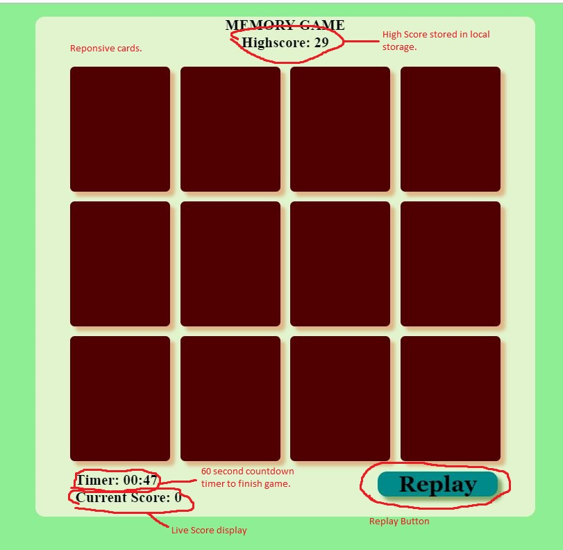
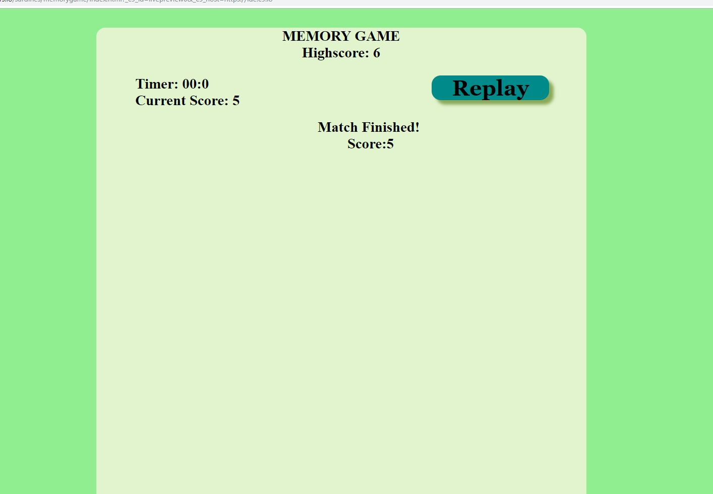
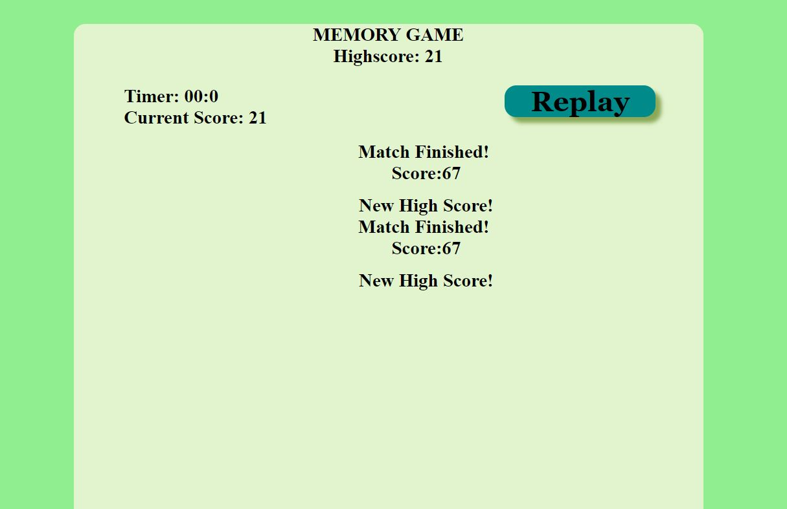

# MemoryGame
A simple memory game made with Jquery
Features:
1. Match cards to score points within given time
Scoring system
    60 s to finish game
    1 points per sec saved
    5 points per correct answer
    -4 points per wrong answer
    store highscores in local storage
    highscore stored in local storage
2. Multiple Win screens
3. Animated, Interactive Cards
4. live score display

